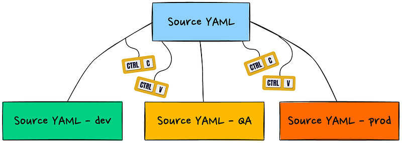

\

# 1 为什么需要 Helm ？

  
- Kubernetes 上的应用对象，都是由特定的资源描述组成，包括 Deployment、Service 等，都保存在各自的文件中或者集中写在一个配置文件，然后通过 `kubectl apply -f` 部署。
- 如果应用只由一个或几个这样的服务组成，上面的部署方式就足够了。
- 但是对于一个复杂的应用，会有很多类似上面的资源描述文件，如：微服务架构应用，组成应用的服务可能多达几十、上百个，如果有更新或回滚应用的需求，可能要修改和维护所涉及到大量的资源文件，而这种组织和管理应用的方式就显得力不从心了。并且由于缺少对发布过的应用进行版本管理和控制，使得 Kubernetes 上的应用维护和更新面临诸多的挑战，主要面临以下的问题：
    - ① 如何将这些服务作为一个整体管理？
    - ② 这些资源文件如何高效复用？
    - ③ 应用级别的版本如何管理？


Kubernetes 帮助我们非常容易的为不同用例创建不同的环境，可以在同一个集群甚至多个集群上使用命名空间，可以托管开发、测试、QA、UAT、预发、生产……等等不同的环境。但问题是：如何管理所有这些环境？
第一种也是最直接的方法是创建相同 manifest 的副本，并为每个副本命名。也就是说，把源文件复制粘贴到每个环境上。



对于只需对每个环境做出极少改动的简单项目，上述方法可能很适用。例如，除了镜像外，所有 YAML 清单都完全相同。可以打开每个目录中的 `deployment.yaml` 文件进行更改，保存后运行 `kubectl apply -f .`，就大功告成了。

  
然而，在大多数情况下，环境之间的差异并不那么简单。请看下面的例子：
- 开发环境通过某些容器命令参数进行调试，而这些参数在 QA 或生产环境中不可用。
- QA 部署了一些边车，用于运行测试，开发和生产环境不具备这种能力。
- 出于显而易见的原因，生产环境的 RBAC 比其他两个环境的限制性更强。

还有其他更多的可能性：
- 应用变得越来越大，需要其他依赖服务。例如，MySQL 后端和 Redis 缓存服务器。每个服务都有自己的清单、配置设置和环境差异。
- 需要实施 CI/CD 流水线，将应用程序(连同其依赖项)测试、构建和部署到多个环境中。

如你所见，单独使用 `kubectl` 会变成一场噩梦，这就是我们开始探索更高级工具(特指 Helm 和 Kustomize)的原因。让我们先来探讨一下它们各自是如何应对上述挑战的。


# 2 Helm 介绍


- [Helm](https://helm.sh/zh/) 是 Kubernetes 的包管理工具，就像 Linux 下的包管理器，如：yum、apt 等，可以很方便的将之前打包好的 yaml 文件部署到 Kubernetes 上。
- Helm是一款强大而灵活的 Kubernetes 软件包管理和运维工具，类似于apt、yum等包管理工具。运用Helm可以极大的简化Kubernetes应用部署。我使用的是Helm3，相比于Helm2其最大的变化是去掉了Tiller，使用起来更加方便。  
- Helm是基于kubernetes 的包管理器。它之于 kubernetes 就如 yum 之于 centos，pip 之于 python，npm 之于 javascript


# 3 Helm的组件 

Helm 是 Kubernetes 中的第一个对应用程序进行管理的支撑工具，经常会拿来同 Yum、apt 等工具进行类比。Helm 由几个不同的组件构成：

Helm: Kubernetes的应用打包工具，也是命令行工具的名称。  
Helm CLI：是 Helm 客户端，可以在本地执行  
Tiller: Helm的服务端，部署在Kubernetes集群中，用于处理Helm的相关命令。

- CLI：客户端工具，有几大功能
    - 从 Chart 服务器获取列表、搜索 Chart 项目
    - 安装 Chart
    - 构建 Chart
    - 充当 Chart 服务器
    - 和 Tiller 协同管理应用生命周期
    - 渲染 Chart 为 Kubernetes 生成 YAML
- Tiller：需要用特定授权和 API Server 进行通信，Kubernetes 集群内外部署都可以。
    - 它是 Helm 的内鬼，负责接收来自 Cli 的指令，完成对集群内应用生命周期的控制。
    - 3.0 中将取消 Tiller。
- Repository：
    - 是存储 Helm Chart 的仓库，可以被 Cli 工具缓存、检索，CLI 也可以获取 Chart 进行后续操作。
    - 和 Tiller 一样，Repository 也不是必要组件，CLI 完全可以仅在本地工作。
  

# 4 Helm 的三大概念


- `Chart` 代表着 Helm 包。它包含在 Kubernetes 集群内部运行应用程序，工具或服务所需的所有资源定义。你可以把它看作是 Homebrew formula，Apt dpkg，或 Yum RPM 在Kubernetes 中的等价物。
- `Repository（仓库）` 是用来存放和共享 charts 的地方。它就像 Perl 的 [CPAN 档案库网络](https://www.cpan.org/) 或是 Fedora 的 [软件包仓库](https://src.fedoraproject.org/)，只不过它是供 Kubernetes 包所使用的。
    - 你可以在 Helm 的 chart repositories 中寻找新的 chart。
- `Release` 是运行在 Kubernetes 集群中的 chart 的实例。一个 chart 通常可以在同一个集群中安装多次。每一次安装都会创建一个新的 release 。以 MySQL chart为例，如果你想在你的集群中运行两个数据库，你可以安装该 chart 两次。每一个数据库都会拥有它自己的 release 和 release name 。
    - Helm 安装 charts 到 Kubernetes 集群中，每次安装都会创建一个新的 release。

可以类比 Docker 来理解，Chart 就类似于 Docker 中的镜像（Docker 中的镜像就是一系列文件的集合，Chart 也是一系列文件的集合），Repository（仓库）就类似于 Docker Hub，Release 就类似于 Docker 中的容器（可以根据镜像 run 多个容器）。


# 5 Helm具有如下功能


- 创建新的chart
- chart打包成tgz格式(chart是Helm的应用打包格式)
- 上传chart到chart仓库或从仓库中下载chart
- 在Kubernetes集群中安装或卸载chart
- 管理用Helm安装的chart的发布周期


# 6 Helm 的特色

- 强大的生命周期管理：有 Tiller 的帮助，可以实现对应用程序实例（Release）的查询、安装、卸载、升级、回滚等复杂操作。
- 严格的基础版本管控：Chart 是一种模板，Chart 的用户仅能通过对 `values` 的控制来定制应用的部署行为，模板中没有提供变量的位置，是无法在下游直接进行变更的。
- 方便的命令行：对于简单变量，可以在部署的同时直接指定内容，方便部署。
- 插件和工具：Helm 拥趸众多，提供了不少用于 CICD 或者其它方面辅助功能的插件和工具。


# 7 例子

作为 Kubernetes 的包管理器，Helm 提供了一种以"图表(charts)"形式打包、分发和管理应用程序的方法。Helm chart 由模板(template)和值(value)文件集合组成，其中模板定义 Kubernetes 资源(如 Deployment、Service、ConfigMap)，值文件允许自定义模板值。

这样就可以拥有一组模板，为在不同部署(或环境)中发生变化的参数提供占位符。例如，下面是一个 Helm 部署模板，它从值文件中获取副本数量、镜像名称和标签、容器端口和容器启动参数：

```yaml
apiVersion: apps/v1
kind: Deployment
metadata:
  name: {{ .Release.Name }}-deployment
spec:
  replicas: {{ .Values.replicaCount }}
  selector:
    matchLabels:
      app: {{ .Release.Name }}
  template:
    metadata:
      labels:
        app: {{ .Release.Name }}
    spec:
      containers:
        - name: {{ .Chart.Name }}
          image: {{ .Values.image.repository }}:{{ .Values.image.tag }}
          ports:
            - containerPort: {{ .Values.containerPort }}
          args:
            - {{ .Values.startupArguments }}
```


`{{` 和 `}}` 之间的内容都是动态的。也就是说，在 chart 部署时，它们会被实际值取代。相应的值文件如下所示：


```
replicaCount: 3

image:
  repository: myapp/image
  tag: v1.0.0

containerPort: 8080

startupArguments: arg1 arg2 arg3
```

**注意：** `.Release.Name` 和 `.Chart.Name` 变量取自 `Chart.yaml`，可视为另一个参数来源，用于为集群中的 Kubernetes 组件赋予唯一的名称，这样我们就能在同一个集群中部署同一 chart 的多个版本。


---

当 Helm 应用于集群时，Kubernetes API 服务器会收到这些信息：

```
apiVersion: apps/v1
kind: Deployment
metadata:
  name: myapp-deployment
spec:
  replicas: 3
  selector:
    matchLabels:
      app: myapp
  template:
    metadata:
      labels:
        app: myapp
    spec:
      containers:
        - name: myapp
          image: myapp/image:v1.0.0
          ports:
            - containerPort: 8080
          args:
            - arg1
            - arg2
            - arg3
```


