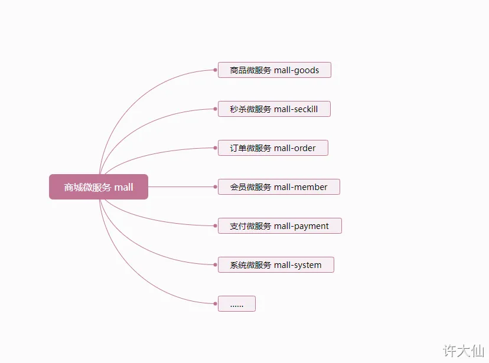
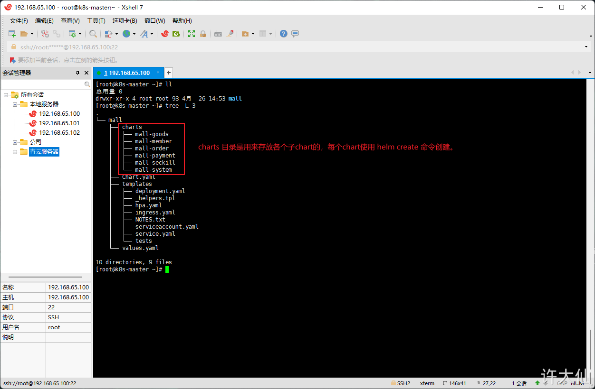

# 1 单体项目

开发步骤：
- ① 使用 helm create 命令创建 chart 。
- ② 进行 chart 目录中的 templates 目录，修改其中的文件，如：deployment.yaml 、service.yaml 等文件。
- ③ 使用 `helm install --dry-run demo3 mychart` 干跑 helm，如果测试没有错误，就执行步骤 ④，否则重复执行步骤 ② 和 ③。
- ④ 使用 helm install 命令安装。

# 2 微服务项目

需要注意子 chart 的重要细节：
- 子chart被认为是“独立的”，意味着子chart从来不会显示依赖它的父chart。
- 因此，子chart无法访问父chart的值。
- 父chart可以覆盖子chart的值。
- Helm有一个 `全局值` 的概念，所有的chart都可以访问。

