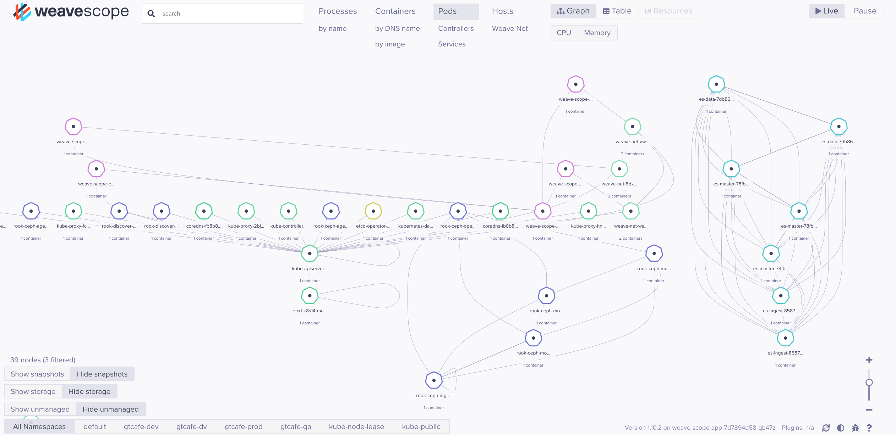

Weave Scope 是個探索 K8s 資源關係與狀態的圖形介面，CNI 需要用 WeaveNet 才能使用。
```
# 安裝方法一  
kubectl apply -f "https://cloud.weave.works/k8s/scope.yaml?k8s-version=$(kubectl version | base64 | tr -d '\n')"  
# kubectl apply -f "https://cloud.weave.works/k8s/scope.yaml?k8s-version=1.14"  
  
## 開啟 port forward  
kubectl port-forward -n weave "$(kubectl get -n weave pod --selector=weave-scope-component=app -o jsonpath='{.items..metadata.name}')" 4040  
  
# 從 Source Code 安裝  
git clone https://github.com/weaveworks/scope  
cd scope  
kubectl apply -f examples/k8s  
  
## 瀏覽  
kubectl port-forward svc/weave-scope-app -n weave 8040:80  
# http://127.0.0.1:8040  
  
## 刪除  
# kubectl apply -f "https://cloud.weave.works/k8s/scope.yaml?k8s-version=1.14"
```





