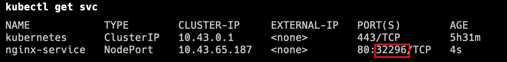

# 1 理论
Service将运行在一组 [Pods](https://kubernetes.io/zh-cn/docs/concepts/workloads/pods/) 上的应用程序公开为网络服务的抽象方法。
Service为一组 Pod 提供相同的 DNS 名，并且在它们之间进行负载均衡。
Kubernetes 为 Pod 提供分配了IP 地址，但IP地址可能会发生变化。
创建完service 后, 集群内的容器可以通过service名称访问服务，而不需要担心Pod的IP发生变化。

Kubernetes Service 定义了这样一种抽象：
service 的后端, 运行了一组可以替换的 Pod
逻辑上的一组可以互相替换的 Pod，通常称为微服务。 
Service 对应的 Pod 集合通常是通过选择算符来确定的。 
举个例子，在一个Service中运行了3个nginx的副本。这些副本是可互换的，我们不需要关心它们调用了哪个nginx，也不需要关注 Pod的运行状态，只需要调用这个服务就可以了。

## 1.1 例子


用 kubectl get all 可以看到 
- 有个 depolyment  : depolyment.apps/nginx-deploy 
- 对应个副本集 replicaset.apps/nginx-depoly-xxx
- 这个副本集右三个 pod, pod/xxxxx
- 还有一个service , 还有一个 kubernetes 自带的 对象, 名字为 service/kubernetes 

# 2 创建Service对象


## 2.1 例子##


```sh
# port是service访问端口.target-port是Pod端口, 容器端口 
# 二者通常是一样的
# 使用 kubectl expose 命令 , 将之前的部署 (depolyment) 公开为服务 
# --port 8080 , 指定service 的端口, 公开的服务端口 为 8080 
#  --target-port 指定的  容器端口 
# --name=xxx, 指定生成 service 的名称 为nginx-service  
kubectl expose deployment/nginx-deployment \
--name=nginx-service - --port=80 --target-port=80
```


ClusterIP 代表为集群内部的IP,  集群内部, 都可以通过 10.43.228.137 这个IP, 来访问 nginx-service 这个 service 


---
进入 某个 nginx 的pod, 将首页显示的信息, 改为 显示 hello


然后再来访问这个服务, 多访问几次 
可以看到 一会访问到的 另一个 pod 的 nignx, 一会访问到了 一个 pod 的 hallo , 这说明 实现了 service 在后端 Pod 中 实现了 负载均衡 


## 2.2 ServiceType 取值

- ClusterIP：
    - 默认情况下, 如果没有指定 serciveType, 自动分配到的 就是 这个 service type 
    - 这个Type 下只能在集群内部的主机, 访问到这个service 
    - 将服务公开在集群内部。kubernetes会给服务分配一个集群内部的 IP，集群内的所有主机都可以通过这个Cluster-IP访问服务。集群内部的Pod可以通过service名称访问服务。
- [NodePort](https://kubernetes.io/zh-cn/docs/concepts/services-networking/service/#type-nodeport)：
    - 想要使得集群外部的主机 也能访问到 这个 service , 需要 , 使用 NodePort  这个 ServiceType 
    - 通过每个节点的主机IP 和静态端口（NodePort）暴露服务。 集群的外部主机可以使用节点IP和NodePort访问服务。
- [ExternalName](https://kubernetes.io/zh-cn/docs/concepts/services-networking/service/#externalname)：将集群外部的网络引入集群内部。
- [LoadBalancer](https://kubernetes.io/zh-cn/docs/concepts/services-networking/service/#loadbalancer)：使用云提供商的负载均衡器向外部暴露服务。

```sh
# port是service访问端口,target-port是Pod端口
# 二者通常是一样的
# 使用 kubectl expose 命令 , 将之前的部署 (depolyment) 公开为服务 
# --port 8080 , 指定service 的端口, 公开的服务端口 为 8080 
#  --target-port 指定的  容器端口 
# --name=xxx, 指定生成 service 的名称 为nginx-service  
kubectl expose deployment/nginx-deployment \
--name=nginx-service --type=ClusterIP --port=80 --target-port=80
```

```sh
# 随机产生主机端口
kubectl expose deployment/nginx-deployment \
--name=nginx-service2 --type=NodePort --port=8080 --target-port=80
```




除了 内部访问的端口, 8081. kubenetes 会随机产生一个 内部访问的端口 31208 . 集群外部的主机可以通过 node节点的 ip + 外部访问端口 , 来访问这个服务

下面是尝试从外部访问一下, 可以看到 访问成功 


# 3 访问Service

外部主机访问：192.168.56.109:32296。
1.NodePort端口是随机的，范围为:30000-32767。
2.集群中每一个主机节点的NodePort端口都可以访问。
3.如果需要指定端口，不想随机产生，需要使用配置文件来声明。


某个 service (Node) 中有 三个 
- targetPort 是 Pod 中运行程序 用来监听的端口 
- Port 是服务 公开的端口 
    - 集群内的主机: ClusterIP 是 集群内的ip 
    - 集群内的容器: 是通过 service 的名称: port  来访问 这个 service 
- nodePort
    - 集群中 每个 节点/node 的公开服务的端口 
    - 集群外的主机, 可以通过 节点的ip+ nodePort 来访问 service 


```sh
#集群内访问
curl 10.43.65.187:80

#容器内访问
kubectl run nginx-test --image=nginx:1.22 -it --rm -- sh
#
curl nginx-service:80
```


